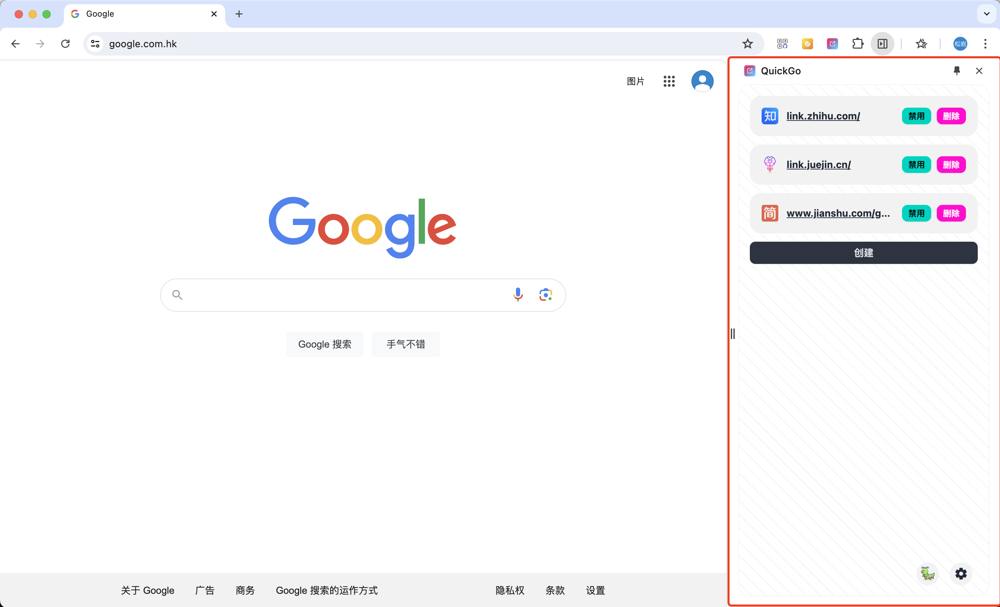

# QuickGo

[Chrome Web Store](https://chromewebstore.google.com/detail/quickgo/homllehcipjgpbpepcojhgcpfdopjhml) Get rid of website security redirect restrictions for smoother access.

[Simplified Chinese](https://github.com/Dolov/chrome-QuickGo/blob/main/README.md) | English

### Features

Many websites have security redirects when accessing external addresses, which can be very time-consuming. This extension can skip security interceptions and quickly access the target URL.

- Supports address configuration.
- Supports theme configuration.

### Instructions

1. When a security redirect occurs on a site, click the extension icon, and an extension page will pop up on the right side of the page.
2. Click the create button, and a pop-up box will appear.
3. Enter the current website address in the pop-up box (usually no need to fill in, there is a default value)
4. Enter the redirection parameter name in the pop-up box, you can observe the address bar (if it is target or url, it will automatically fill in)
5. Save and refresh the page

### Example

### Welcome

If you encounter problems during use or have new feature requests, you can provide feedback in the issues.

### Development Build

1. Install Node.js https://nodejs.org/en/download/package-manager
2. npm i
3. npm build
4. npm package
