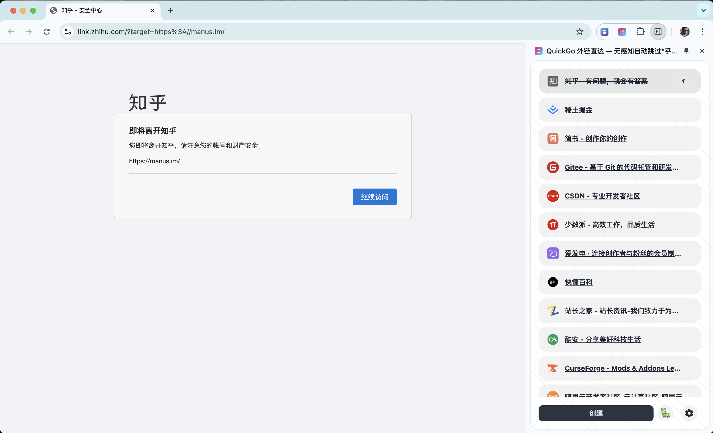

# QuickGo

[chrome web store](https://chromewebstore.google.com/detail/quickgo/homllehcipjgpbpepcojhgcpfdopjhml) QuickGo 外链直达 — 无感知自动跳过知乎、简书、掘金、CSDN、少数派、Gitee 等网站的安全中心跳转限制。

[English](https://github.com/Dolov/chrome-QuickGo/blob/main/README.en-US.md) | 简体中文

### 🚀 功能亮点

你是否在知乎、CSDN、掘金、简书等网站上点击外链时，总是被拦截到“安全中心”，还得多点一次才能继续？是不是觉得太麻烦了？😩

别担心，**QuickGo** 🏎️ 来帮你！它能 **自动绕过繁琐跳转，无感直达目标页面**，让你的浏览体验更加丝滑，省时又省心！💨 **想去哪就去哪，畅行无阻！快人一步，从此告别多余点击！** 🎯

✨ **核心功能**：

- 📦 **即装即用**，支持知乎、简书、掘金、CSDN、少数派、Gitee 等网站，一键跳转，无需多余操作！
- 🎨 **精美 UI**，多款主题随心切换，打造个性化浏览体验！
- ✏️ **自定义规则**，支持手动添加未适配网站，让你自由掌控跳转路径！
- 🖱️ **极简操作**，无需复杂设置，安装即生效，顺畅直达目标！ 🚀

### 🛠️ 自定义规则指南

轻松绕过安全跳转，只需简单几步！👇

1️⃣ 当某个站点出现安全跳转时，**点击扩展图标**，页面右侧将弹出扩展窗口。  
2️⃣ 点击 **“创建”** 按钮，打开设置弹窗。  
3️⃣ 在弹窗中输入 **当前网站地址**（通常会自动填充，无需手动输入）。  
4️⃣ 在弹窗中输入 **重定向参数名**，可观察地址栏（通常会自动填充，若未填充，可手动查找，常见名称如 `target` 或 `url`）。  
5️⃣ **保存并刷新页面**，立即生效，畅通无阻！ 🚀

### 🎉 欢迎使用 QuickGo

如果在使用过程中遇到问题，或者有新功能的需求，欢迎在 **issues** 中反馈，我们会及时跟进！🚀

### 🛠️ 开发 & 构建指南

1️⃣ **安装 Node.js** 👉 [下载地址](https://nodejs.org/en/download/package-manager)  
2️⃣ **安装依赖**：`npm i`  
3️⃣ **构建项目**：`npm build`  
4️⃣ **打包扩展**：`npm package`

💡 快速上手，贡献你的想法，让 QuickGo 变得更强大！🎯
